<p align="center">
  
</p>

<h1 align="center">OwO AI Gateway</h1>

<p align="center">
  A model gateway that runs on your machine.<br>
  Codex, Claude Code, Cursor, and other AI coding apps share one set of providers, models, and keys.
</p>

<p align="center">
  <a href="LICENSE"></a>
  
  
  
</p>

<p align="center"><b>English</b> · <a href="README.zh-CN.md">简体中文</a></p>

<p align="center">
  <a href="#features">Features</a> ·
  <a href="#compare">Compare</a> ·
  <a href="#quick-start">Quick start</a> ·
  <a href="#apps">Supported apps</a> ·
  <a href="#providers">Provider presets</a> ·
  <a href="#security">Security</a> ·
  <a href="#architecture">Architecture</a>
</p>

<p align="center">
  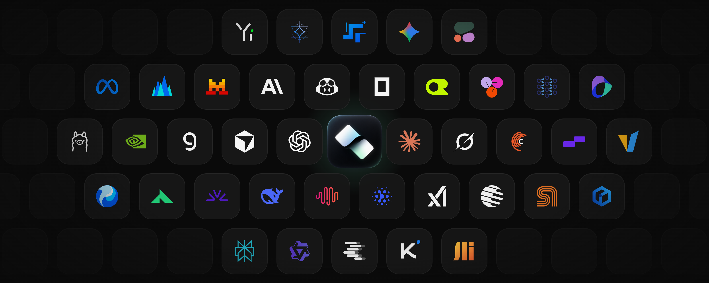
</p>

<br>

<table>
  <tr>
    <td align="center" width="20%"><b>Native Rust</b><br><sub>One executable, about 4 MB of private memory at idle</sub></td>
    <td align="center" width="20%"><b>One config</b><br><sub>Providers, models, prices, and keys written once and shared</sub></td>
    <td align="center" width="20%"><b>Three protocols</b><br><sub>Responses, Chat Completions, and Messages</sub></td>
    <td align="center" width="20%"><b>Undoable</b><br><sub>App settings are backed up before changes and restored on disconnect</sub></td>
    <td align="center" width="20%"><b>Local</b><br><sub>Listens on 127.0.0.1 by default; keys stay in the OS keyring</sub></td>
  </tr>
</table>

<br>

<p align="center">
  OwO AI Gateway ships as one Rust executable, <code>owo</code>, and needs neither Node.js nor Python.<br>
  Connected apps keep their own interface, history, tools, and permissions; their requests just go to the models you configure.<br>
  An optional desktop app shows usage and edits the configuration.
</p>

<a id="features"></a>

<br>

<h2 align="center">Dashboard</h2>

<p align="center"></p>

- Today's calls, tokens, cost, and cache hit rate, each with its 14-day trend.
- A heatmap of calls for every day of the year.
- Input and output tokens over the last 14 days, switchable to cost.
- The share of successful, failed, and cancelled calls over the last 7 days.
- Each app's share of tokens over the last 7 days, and the models ranked by usage.
- The latest calls; click through to the call history.
- The page refreshes on its own and pauses while the window is minimised.

<br>

<h2 align="center">Usage</h2>

<p align="center"></p>

- The last 1, 7, 30, or 90 days, grouped by model, app, provider, or day.
- A ring for the shares and bars comparing input with output.
- A table of calls, input, output, cache hits, cost, and totals.
- Cost is estimated from the prices set on each model (USD per million tokens); cache reads and writes can be priced separately.

<br>

<h2 align="center">History</h2>

<p align="center">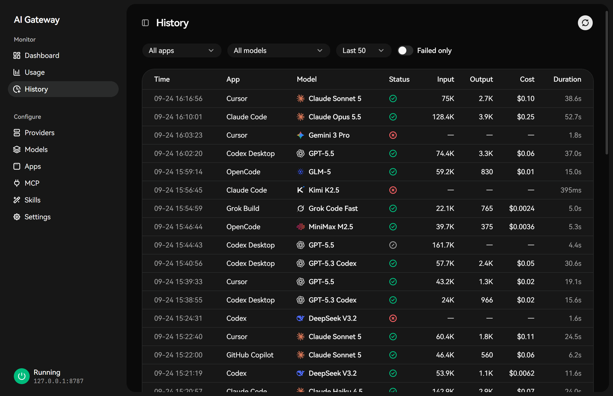</p>

- Filter by app or model, or show failed calls only.
- Each row has the time, app, model, status, input and output tokens, cost, and duration.
- The details show the model requested, the provider and upstream model actually used, the token breakdown, time to first token, and the failure reason.
- Only this metadata is recorded; prompts and responses are not stored.

<br>

<h2 align="center">Providers</h2>

<p align="center">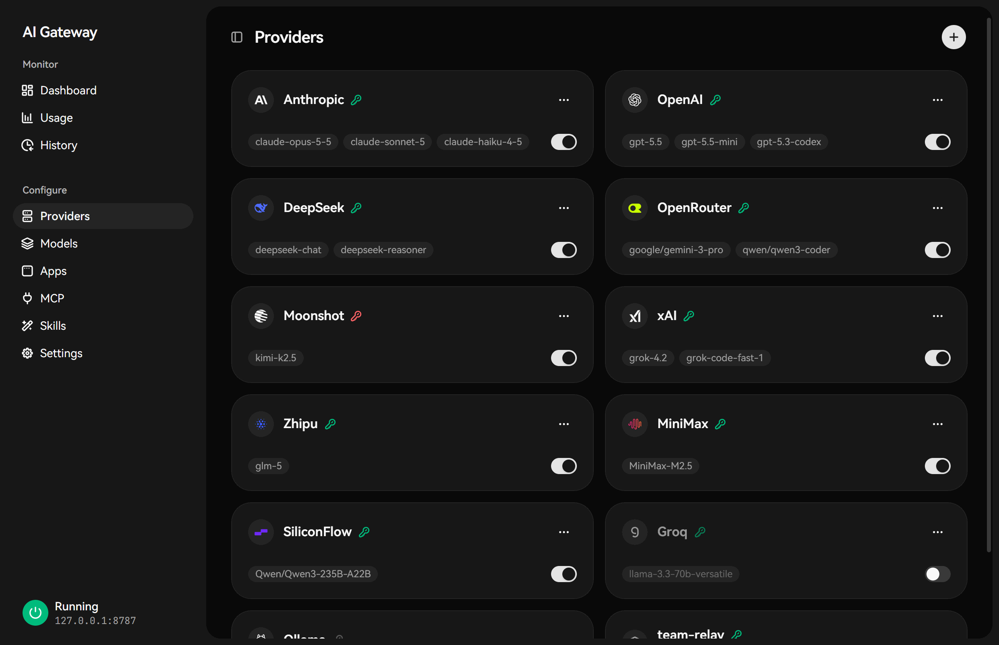</p>

<p align="center">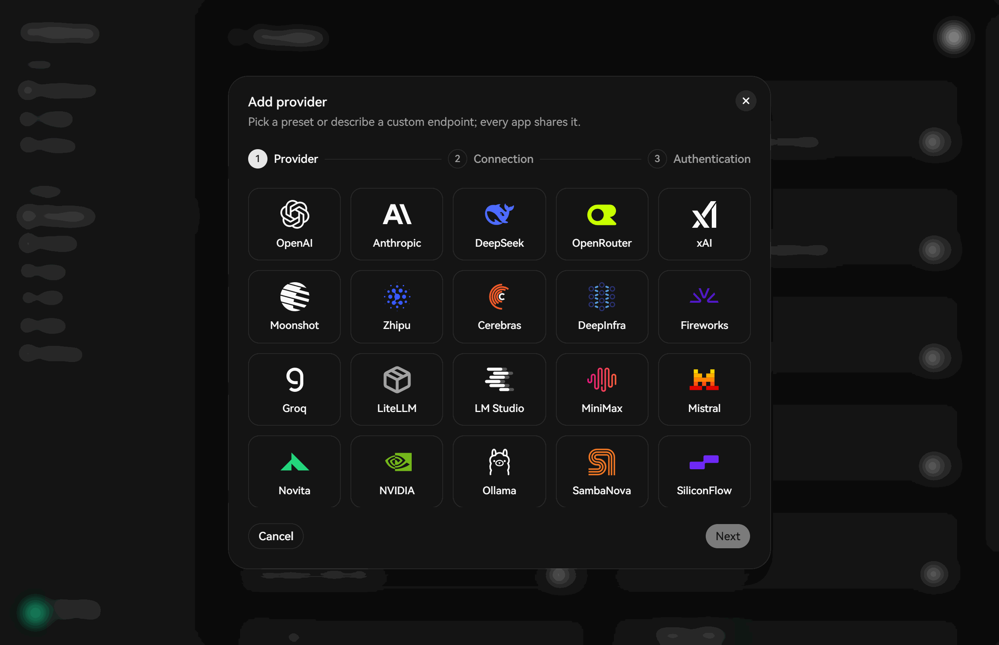</p>

- Adding a provider takes three steps: pick it, fill in the connection, set the key. There are 25 usable presets, including OpenAI, Anthropic, DeepSeek, OpenRouter, xAI, Moonshot, Zhipu, MiniMax, Groq, SiliconFlow, and Ollama.
- Any OpenAI-compatible or Anthropic-compatible address works too, and a preset's base URL can point at a relay.
- Keys are kept in the OS keyring or read from an environment variable; each card shows the key's state.
- The switch in a card's corner enables or disables the provider. Model ids can be added one at a time or pasted in bulk.

<br>

<h2 align="center">Models</h2>

<p align="center">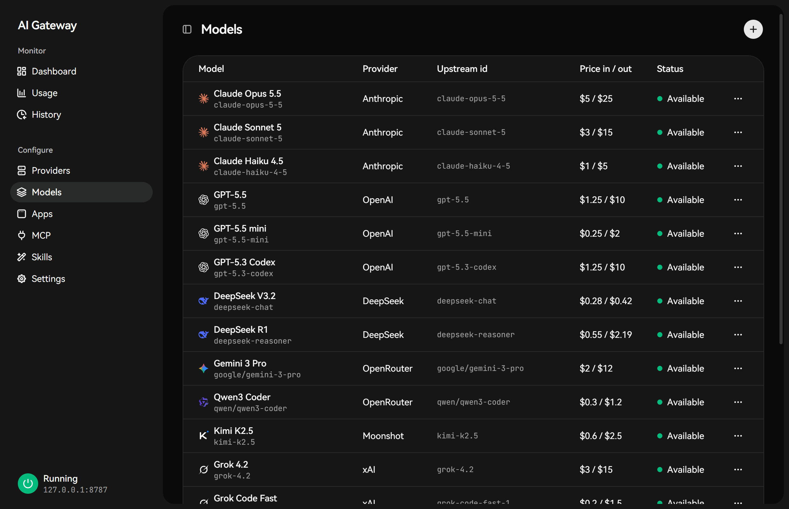</p>

- Give an upstream model your own id and display name; every app calls it by that name.
- Input, output, cache-read, and cache-write prices can be set for cost estimates.
- The interface shows the display name and the vendor's logo.

<br>

<h2 align="center">Apps</h2>

<p align="center">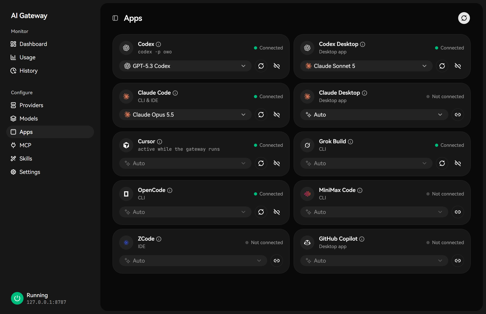</p>

- Codex CLI, Codex Desktop, Claude Code, Claude Desktop, Cursor, Grok Build, OpenCode, MiniMax Code, ZCode, and GitHub Copilot.
- Connect, reconnect, and disconnect from each card. The app's settings are backed up before connecting and restored on disconnect.
- Codex and Claude can take a default model; the other apps pick OwO's models in their own interface.

<br>

<h2 align="center">MCP servers</h2>

<p align="center">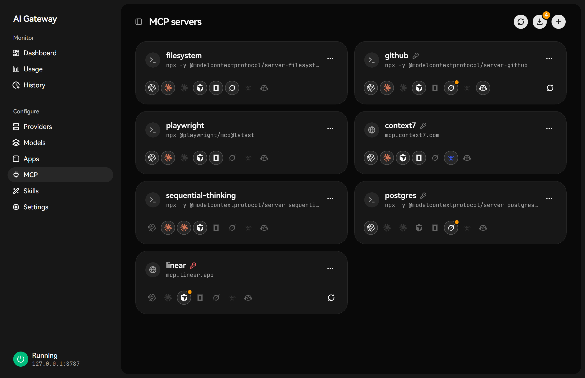</p>

<p align="center">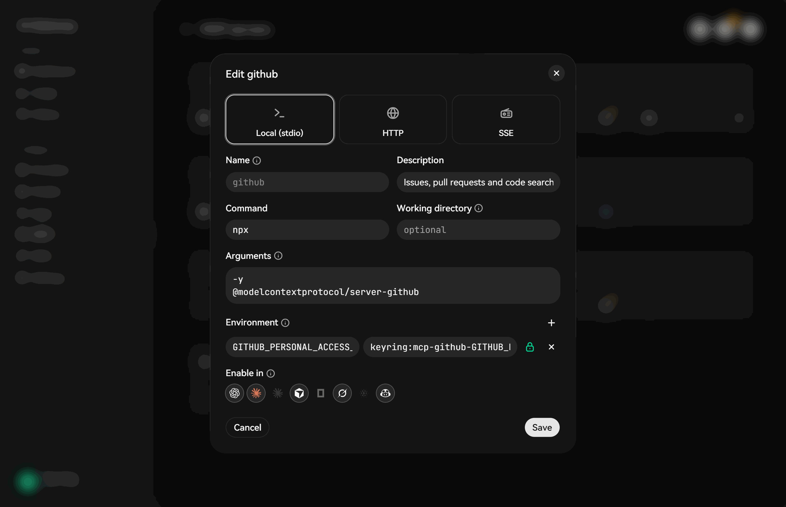</p>

- One server can be written into Codex, Claude Code, Claude Desktop, Cursor, OpenCode, Grok Build, MiniMax Code, ZCode, and Copilot, each with its own switch.
- Local commands (stdio) and remote HTTP / SSE servers are supported.
- Secrets in environment variables and headers can be stored in the OS keyring.
- Servers the apps already have can be scanned and imported.
- If an entry was changed by someone else after OwO wrote it, OwO reports a conflict instead of overwriting it.

<br>

<h2 align="center">Skills</h2>

<p align="center">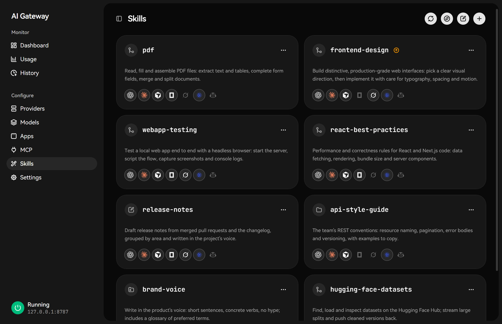</p>

<p align="center">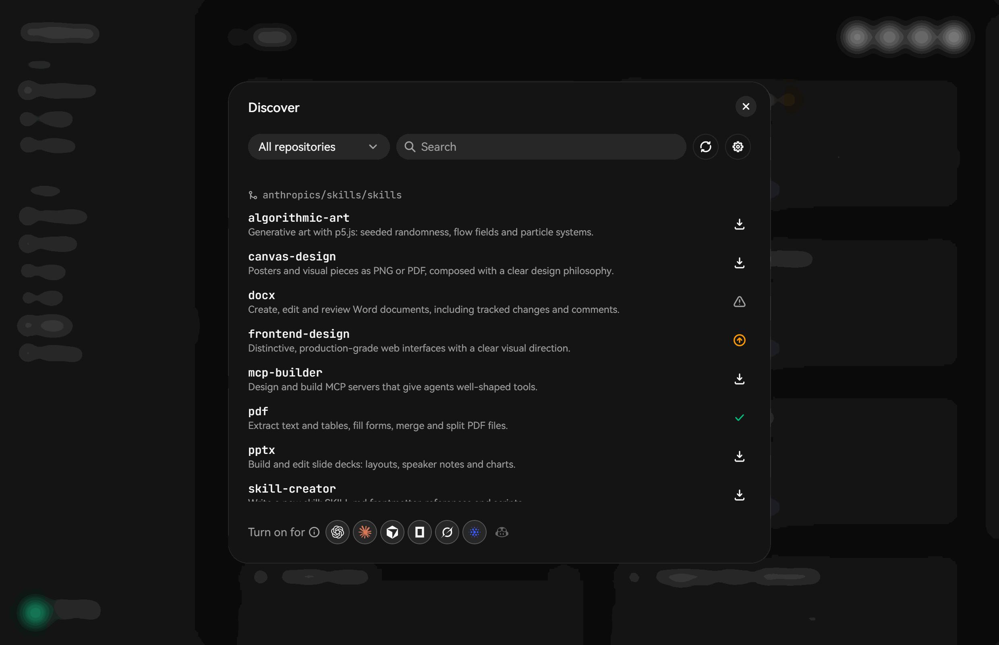</p>

<p align="center">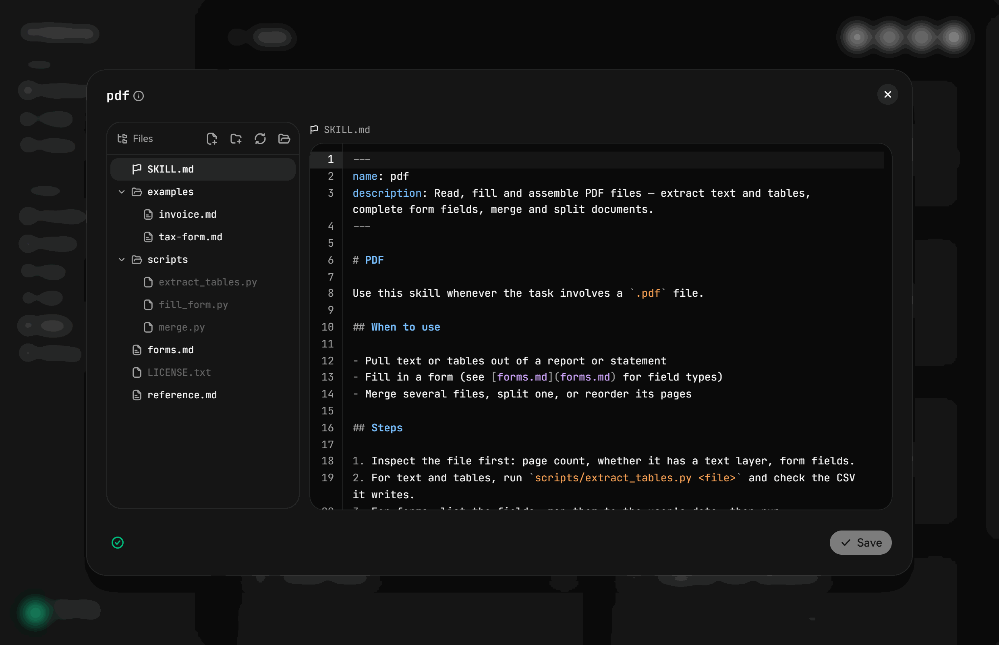</p>

- Skills live in `~/.agents/skills`, with a switch for each app.
- Search and install from the anthropics, openai, vercel-labs, huggingface, and MiniMax-AI skill repositories, or install a local folder or zip. New versions are flagged.
- The editor shows the skill's file tree on the left; any Markdown file in the skill can be edited, with `SKILL.md` marked as the entry. Files and folders can be created, renamed, and deleted, and format problems are reported.
- A backup is made before any removal or update. Skills already on the machine that OwO doesn't manage can be adopted.

<br>

<h2 align="center">Settings</h2>

<p align="center"></p>

<p align="center">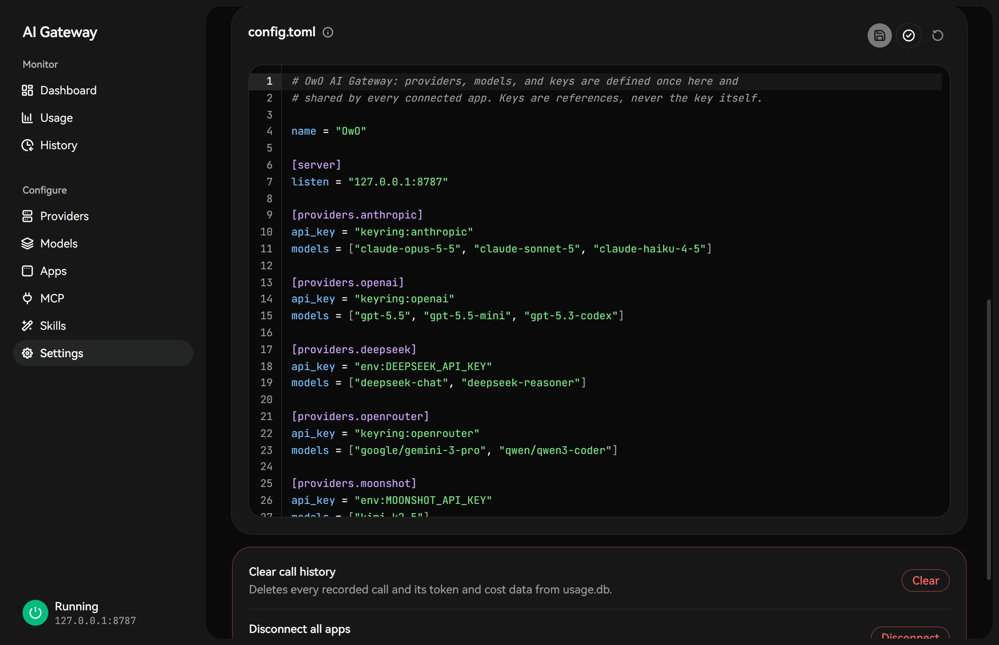</p>

- Display name, listen address, and whether the gateway starts when the desktop app opens.
- Light, dark, or system theme; the interface is available in 简体中文, English, and 日本語.
- `config.toml` can be edited directly; it is validated before saving and the failing line is highlighted.
- Clearing history, disconnecting all apps, and resetting the config are at the bottom of the page and ask for confirmation.

<a id="compare"></a>

<br>

<h2 align="center">Compared with similar projects</h2>

<br>

<h3 align="center">How it is used</h3>

<div align="center">

| | **OwO AI Gateway** | CC Switch | Claude Code Router | LiteLLM Proxy | New API |
|---|:---:|:---:|:---:|:---:|:---:|
| How it works | Writes the models into each app's model picker | Switches the provider config an app currently uses; optional local proxy | Local routing gateway that forwards by rules | General API gateway | API distribution and billing platform |
| Models shown in the app | Every provider's models under their own names | The app's built-in model names, mapped to the current provider | The app's original model names; routing rules pick the real model | Entered in the app by hand | Entered in the app by hand |
| Switching models | Pick one in the app's model picker | Switch providers in CC Switch; most tools need a restart | Edit routing rules or use the `/model` command | Edit the app's config | Edit the app's config |
| Several providers at once | ✅ each conversation can use a different model | One provider per app at a time | ✅ routing rules | ✅ | ✅ |

</div>

OwO uses each app's own model mechanism:

- **Codex CLI / Desktop**: OwO writes Codex's model catalog, so its models appear in `/model` and in the Desktop model picker.
- **Claude Code**: Claude Code reads the available models from the gateway and lists them in `/model`. Ids Claude would otherwise hide get a prefix so they show up.
- **Cursor**: OwO's models appear next to Cursor's built-in ones.
- **OpenCode, Grok Build, MiniMax Code, ZCode, and Claude Desktop**: added as a provider with its model list.

<br>

<h3 align="center">Features</h3>

<div align="center">

| | **OwO AI Gateway** | CC Switch | Claude Code Router | LiteLLM Proxy | New API |
|---|:---:|:---:|:---:|:---:|:---:|
| Connects coding apps | ✅ 10 | ✅ 7 | ✅ launch profiles | — | — |
| Cursor | ✅ | — | — | — | — |
| Protocol translation (Responses / Chat / Messages) | ✅ | ✅ | ✅ | ✅ | ✅ |
| Byte-for-byte restore on disconnect, no overwrite on conflict | ✅ | Config backups | — | — | — |
| Keys in the OS keyring | ✅ | — | — | — | — |
| MCP written into each app's config | ✅ 9 apps | ✅ | Gateway-side tools | — | — |
| Agent Skills discovery and install | ✅ | ✅ | — | — | — |
| Editing a skill's files in the app | ✅ | — | — | — | — |
| Usage, cost, and call history | ✅ | ✅ | ✅ | ✅ | ✅ |

</div>

<p align="center"><sub>Based on each project's public documentation as of September 2026. “—” means the docs describe no such feature, or it is outside that project's scope.</sub></p>

<br>

<h3 align="center">Performance and footprint</h3>

<div align="center">

| | **OwO AI Gateway** | CC Switch | Claude Code Router | LiteLLM Proxy | New API |
|---|:---:|:---:|:---:|:---:|:---:|
| Built with | Rust | Rust + WebView (Tauri desktop app) | TypeScript (Node.js) | Python | Go |
| Gateway runs on its own | ✅ one process | Needs the desktop app running | ✅ | ✅ | ✅ |
| Runtime and dependencies | None | The desktop app | Node.js 22+ | Python 3; the admin UI and spend tracking need PostgreSQL | A database (SQLite / MySQL / PostgreSQL), usually deployed with Docker |
| Idle memory (private) | **~4 MB** (measured) | ~250 MB (measured) | ~156 MB (measured) | 4 GiB per worker recommended | Not published |
| Deployment requirements | None in particular | A desktop | Node.js 22+ | 4 vCPU / 8 GB for production | Docker and a database |

</div>

<div align="center">

| Idle memory, measured | Version | State while measured | Private | Working set |
|---|:---:|---|:---:|:---:|
| **OwO AI Gateway** | 0.1.0 (release build) | Gateway running, 1 provider configured | **~3.8 MB** | ~13.8 MB |
| Claude Code Router | 3.1.1 (npm) | `ccr serve --gateway`: gateway and web management service, 1 provider configured | ~156 MB | ~145 MB |
| CC Switch | 3.20.3 (Windows portable) | Desktop app running: 1 main process and 6 WebView2 processes, local proxy off | ~250 MB | ~455 MB* |

</div>

<div align="center">

| OwO startup, measured | Result |
|---|---|
| CLI cold start | ~23 ms |
| Gateway start to listening | 5 – 23 ms |
| `owo start` to accepting connections | ~0.5 s (including process creation) |

</div>

<p align="center"><sub>Test conditions: the same Windows 11 machine, 25 September 2026. OwO and Claude Code Router each had a local Ollama provider that needs no key; CC Switch was in its default state after first launch; no requests were sent. Sampling began about 15 s after start, three samples 10 s apart, stable values taken, whole process tree counted.<br>* Working set counts memory shared between WebView2 processes more than once; compare processes by private memory. LiteLLM Proxy and New API were not measured; their figures come from public material: <a href="https://docs.litellm.ai/docs/proxy/prod">LiteLLM production best practices</a>, <a href="https://github.com/QuantumNous/new-api">New API README</a>. For architecture see also the <a href="https://ccswitch.co/docs/proxy-service.html">CC Switch proxy docs</a> and the <a href="https://github.com/musistudio/claude-code-router">Claude Code Router README</a>.</sub></p>

<br>

**How OwO differs**

- Models appear in each app's own model picker under their real names. Each conversation can use a different model, and switching doesn't need a restart.
- The gateway is one Rust executable built on Tokio and axum; streamed responses are forwarded event by event without waiting for the whole reply. It needs no Node.js, Python, database, or Docker, and the desktop app doesn't have to be open. At idle it uses about 4 MB of private memory, roughly 1/40 of Claude Code Router and 1/60 of CC Switch.
- It connects 10 apps, including Cursor, which none of the other projects above support.
- On disconnect, an untouched config file is restored byte for byte, and an edited one only loses OwO's entries; conflicts are not overwritten by default. OwO never reads or changes an app's login credentials.
- The config holds only `keyring:` or `env:` references; keys stay in the OS keyring. Call history doesn't store prompts or responses.
- Models, MCP servers, and skills are configured in one place and switched per app.

If you need to hand out API access to a team, bill per user, or fail over automatically between upstreams, New API or LiteLLM Proxy is a better fit. If you mostly switch providers in Gemini CLI or OpenClaw, consider CC Switch.

<a id="quick-start"></a>

<br>

## Quick start

For now, build from source (Rust 1.85 or newer):

```bash
cargo install --path apps/owo --locked     # installs owo; or cargo build --release -p owo (binary in target/release/)
```

First run:

```bash
owo add anthropic          # add a provider: asks for its key (not echoed), stores it in the OS keyring, writes config.toml
owo start -d               # run the gateway in the background (127.0.0.1:8787); owo start runs it in the foreground
owo connect claude         # point Claude Code at the gateway; owo connect on its own lists every app
owo                        # overview: gateway, models, key problems, connected apps, next steps
```

More providers and models:

```bash
owo providers presets                       # built-in presets
owo add deepseek --env DEEPSEEK_API_KEY     # read the key from an environment variable
owo add ollama --no-key -m qwen3:8b         # a local server that needs no key
owo add relay --url https://llm.example.com/v1 -m some-model   # any OpenAI-compatible API
owo providers discover openrouter           # the models a provider serves right now
owo check                                   # check config, keys, and models without starting the gateway
```

Day to day:

```bash
owo connect codex-desktop -m claude-sonnet-5   # connect with a default model
owo launch codex                                # this run only; no Codex file is changed
owo usage --days 30 --by app                    # the last 30 days, per app
owo history --failed                            # recent failed calls
owo history 42                                  # call 42 in full
owo disconnect claude                           # undo owo connect and restore the app's settings
owo stop                                        # stop the gateway
```

MCP and skills:

```bash
owo mcp add github --command npx --arg -y --arg @modelcontextprotocol/server-github \
    --env GITHUB_PERSONAL_ACCESS_TOKEN=keyring:mcp-github-GITHUB_PERSONAL_ACCESS_TOKEN --app claude,cursor,codex
owo mcp enable github --app opencode       # turn it on for more apps
owo mcp scan                               # servers the apps have that OwO does not manage
owo mcp import all fetch --keyring         # take one over; values that look like secrets move to the keyring

owo skills discover                        # skills in the built-in GitHub repositories
owo skills install github:anthropics/skills/skills/pdf
owo skills disable pdf --app codex         # turn it off for one app
owo skills update --check                  # check for updates
```

Every command has `--help`; the full guide is [docs/CLI.zh-CN.md](docs/CLI.zh-CN.md) (Chinese).

<a id="apps"></a>

## Supported apps

| Name | App | How it connects |
|---|---|---|
| `codex` | Codex CLI | Adds an `owo` profile, started with `codex -p owo`; plain `codex` is unchanged |
| `codex-desktop` | Codex Desktop | Edits `~/.codex/config.toml`; independent of `codex` |
| `claude` | Claude Code (CLI and IDE extensions) | Writes `env` in `~/.claude/settings.json`; no Claude account login needed |
| `claude-desktop` | Claude Desktop | Uses the Desktop app's own third-party inference configuration |
| `cursor` | Cursor | OwO models appear next to Cursor's own; the first connect installs a local certificate that can only issue for `*.cursor.sh` |
| `grok` | Grok Build | Appends a marked block to `~/.grok/config.toml` |
| `opencode` | OpenCode | Writes `~/.config/opencode/opencode.json` |
| `mcode` | MiniMax Code | Writes `~/.minimax/config.yaml` |
| `zcode` | ZCode | Writes ZCode's provider configuration |
| `copilot` | GitHub Copilot app | Added by hand in the app; `owo connect copilot` prints what to enter |

The MiniMax CLI (`mmx`) is launch-only: `owo launch mmx text chat|repl`. `owo launch` supports `claude`, `codex`, `opencode`, and `mmx`.

<a id="providers"></a>

## Built-in provider presets

Defined in [`registry/providers.toml`](registry/providers.toml); add one with `owo add <preset>`:

| Kind | Presets |
|---|---|
| Anthropic protocol | `anthropic` |
| OpenAI-compatible | `openai`, `openrouter`, `deepseek`, `xai`, `groq`, `cerebras`, `mistral`, `together`, `fireworks`, `moonshot`, `minimax`, `nvidia`, `siliconflow`, `zhipu-bigmodel`, `volcengine`, `deepinfra`, `novita`, `sambanova`, `stepfun` |
| Local, no key | `ollama`, `vllm`, `lm-studio`, `litellm` |
| Not available yet | `google` (the Gemini adapter is not implemented) |

Anything else: `owo add <name> --url <endpoint>` for an OpenAI-compatible API, plus `--adapter anthropic` for an Anthropic-compatible one.

<a id="security"></a>

## Security and privacy

- **Network**: listens only on `127.0.0.1:8787` by default; any other address requires `server.auth_token`. The control API (`/control/v1`) checks the request origin and guards against DNS rebinding.
- **Keys**: `config.toml` holds references (`keyring:NAME` or `env:VAR`); the keys themselves live in the OS keyring (Windows Credential Manager, macOS Keychain, or Linux Secret Service). Logs, CLI output, and the control API never print a key, and a key written into the config shows only as `inline`.
- **Call history**: `~/.owo/state/usage.db` holds metadata and token counts, not prompts or responses. Error messages have URL query strings removed and are capped at 500 characters.
- **Config changes**: app settings are backed up, and the old values recorded, before anything changes. `disconnect` restores a file byte for byte if it is untouched since connecting, and otherwise removes only OwO's entries. Conflicts are left alone unless you pass `-f`.
- **Login credentials**: no app's login credentials are read or changed, for example Codex's `~/.codex/auth.json`.
- **Accounts and clients**: OwO does not forge subscriptions or account entitlements, and does not pose as an official client to get past an upstream's admission rules. When an upstream admits only its own client, OwO says so.

<a id="architecture"></a>

## Architecture

Every inbound request is decoded into one internal request and event model (`owo-core`); the router hands it to an outbound adapter, which encodes it for the upstream. Adding an app or a provider means writing its own encoder and decoder, not a converter for every pair of protocols.

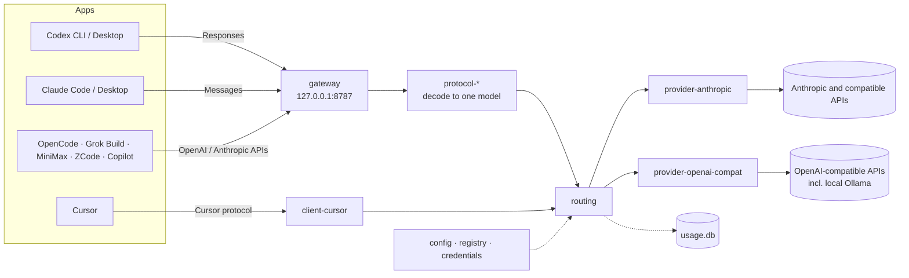

| Crate | Role |
|---|---|
| `core` | The shared request, event, and error model |
| `sse` | Incremental SSE decoding and encoding |
| `config` | `config.toml` schema, paths, and validation |
| `credentials` | Key references (environment variables, OS keyring) |
| `registry` | Provider presets, the model registry, aliases |
| `protocol-openai-responses`, `protocol-openai-chat`, `protocol-anthropic` | Each protocol to and from the shared model |
| `routing` | The adapter contract and the request router |
| `provider-http`, `provider-openai-compat`, `provider-anthropic` | Upstream HTTP plumbing and adapters |
| `gateway` | The local HTTP gateway: app-facing endpoints and the control API |
| `usage` | Call history and token usage (SQLite) |
| `client-codex`, `client-claude-code`, `client-apps` | Reversible app integrations (`client-apps`: Grok Build, OpenCode, MiniMax, ZCode, Copilot) |
| `client-cursor`, `cursor-semble` | The Cursor integration and the local semantic code search it uses |
| `mcp`, `skills` | MCP servers and Agent Skills |

## Repository layout

```text
apps/owo/                 the owo CLI: gateway and every management command, one executable
apps/desktop/             desktop app (Tauri 2 + React)
crates/                   the crates above
registry/providers.toml   built-in provider presets
docs/                     CLI guide and images
```

## Development

```bash
cargo test --workspace
cargo clippy --workspace --all-targets -- -D warnings
```

The desktop app needs Node.js and the [Tauri 2 prerequisites](https://v2.tauri.app/start/prerequisites/):

```bash
cd apps/desktop
npm install
npm run tauri dev
```

The desktop app reads the config and usage data directly and edits providers, models, and `config.toml` itself. Starting and stopping the gateway, connecting apps, and MCP and skill changes go through the `owo` CLI, which is built into the desktop executable: run with `--owo-cli` as its first argument, the app behaves exactly like `owo` (set `OWO_BIN` to use a separately built `owo` instead).

To build the portable single-file release (the desktop app with the CLI inside, no installer):

```bash
cd apps/desktop
npm run release    # → target/release/OwO-AI-Gateway_<version>_x64.exe
```

<br>

<p align="center">
  <br>
  <sub><a href="LICENSE">MIT</a> © 2026 OwO</sub>
</p>
