<p align="center">
  
</p>

<h1 align="center">OwO AI Gateway</h1>

<p align="center">
  在本机运行的模型网关。<br>
  Codex、Claude Code、Cursor 等 AI 编程应用共用一套提供商、模型和密钥。
</p>

<p align="center">
  <a href="LICENSE"></a>
  
  
  
</p>

<p align="center"><b>简体中文</b> · <a href="README.en.md">English</a></p>

<p align="center">
  <a href="#features">功能</a> ·
  <a href="#compare">对比</a> ·
  <a href="#quick-start">快速上手</a> ·
  <a href="#apps">支持的应用</a> ·
  <a href="#providers">提供商预设</a> ·
  <a href="#security">安全与隐私</a> ·
  <a href="#architecture">架构</a>
</p>

<br>

<table>
  <tr>
    <td align="center" width="20%"><b>Rust 原生</b><br><sub>单个可执行文件，空闲时私有内存约 4 MB</sub></td>
    <td align="center" width="20%"><b>一份配置</b><br><sub>提供商、模型、价格和密钥写一次，各应用共用</sub></td>
    <td align="center" width="20%"><b>三种协议</b><br><sub>支持 Responses、Chat Completions 和 Messages</sub></td>
    <td align="center" width="20%"><b>可以撤销</b><br><sub>修改应用配置前先备份，断开时还原</sub></td>
    <td align="center" width="20%"><b>只在本机</b><br><sub>默认监听 127.0.0.1，密钥存在系统钥匙串</sub></td>
  </tr>
</table>

<br>

<p align="center">
  OwO AI Gateway 由一个 Rust 可执行文件 <code>owo</code> 提供，不依赖 Node.js 或 Python。<br>
  接入后，各应用的界面、历史记录、工具和权限都不变，只是请求会发到你配置的模型上。<br>
  另有一个可选的桌面应用，用来看用量和修改配置。
</p>

<a id="features"></a>

<br>

<h2 align="center">仪表盘</h2>

<p align="center">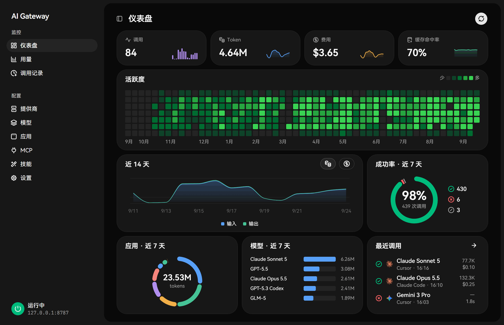</p>

- 今天的调用次数、Token、费用和缓存命中率，各带近 14 天的走势。
- 全年每天的调用热力图。
- 近 14 天输入、输出 Token 的趋势，可以切换成费用。
- 近 7 天调用的成功、失败和取消比例。
- 近 7 天各应用的 Token 占比，以及模型用量排行。
- 最近几次调用，点击可进入调用记录。
- 页面会自动刷新，窗口最小化时暂停。

<br>

<h2 align="center">用量</h2>

<p align="center">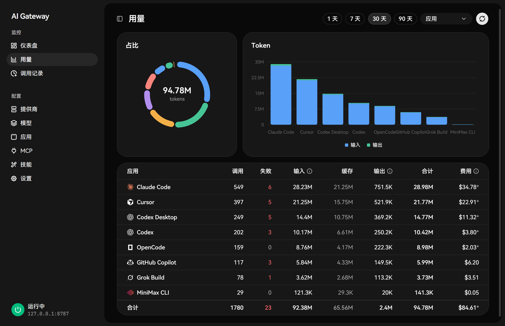</p>

- 可以查看最近 1、7、30 或 90 天，按模型、应用、提供商或日期分组。
- 环图显示占比，柱状图对比输入和输出。
- 表格列出调用次数、输入、输出、缓存命中、费用和合计。
- 费用按模型上设置的价格估算（美元 / 百万 Token），缓存读写可以单独定价。

<br>

<h2 align="center">调用记录</h2>

<p align="center">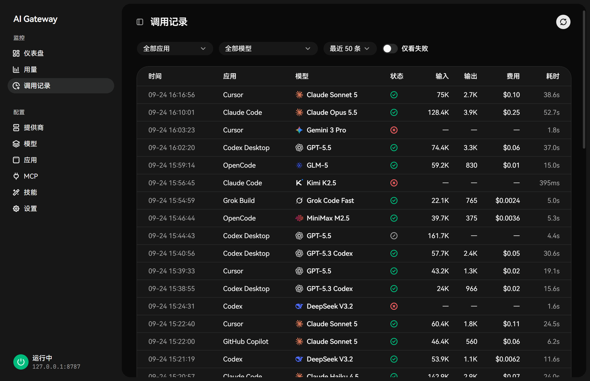</p>

- 可以按应用、模型筛选，或只看失败的调用。
- 每条记录包括时间、应用、模型、状态、输入和输出 Token、费用和耗时。
- 详情里可以看到请求的模型、实际转发到的提供商和上游模型、Token 明细、首 Token 耗时和失败原因。
- 只记录这些元数据，不保存提示词和回复。

<br>

<h2 align="center">提供商</h2>

<p align="center">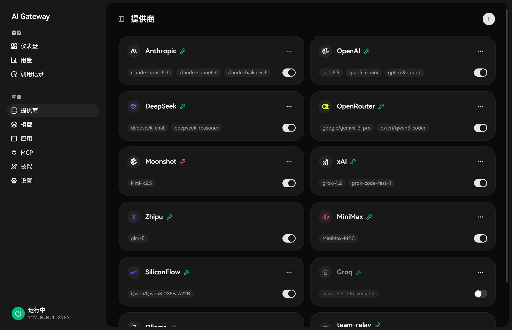</p>

<p align="center">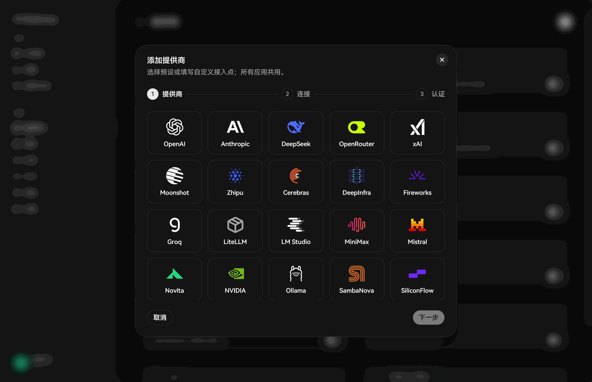</p>

- 添加分三步：选提供商、填连接信息、设置密钥。目前有 25 个可用的预设，包括 OpenAI、Anthropic、DeepSeek、OpenRouter、xAI、Moonshot、智谱、MiniMax、Groq、SiliconFlow 和 Ollama 等。
- 也可以填任意 OpenAI 兼容或 Anthropic 兼容的地址。预设的 Base URL 可以改成中转地址。
- 密钥存在系统钥匙串里，或从环境变量读取，卡片上会显示密钥状态。
- 卡片右下角的开关用来启用或停用提供商。模型 ID 可以逐个添加，也可以批量粘贴。

<br>

<h2 align="center">模型</h2>

<p align="center">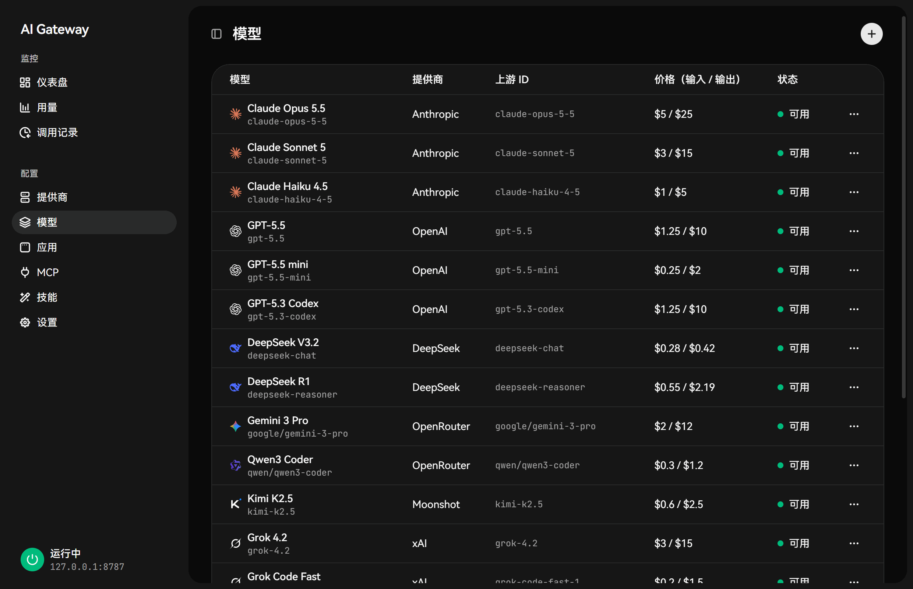</p>

- 给上游模型起自己的 ID 和显示名，各应用都用这个名字调用它。
- 可以设置输入、输出、缓存读和缓存写的价格，用于估算费用。
- 界面上优先显示模型的显示名和厂商图标。

<br>

<h2 align="center">应用</h2>

<p align="center">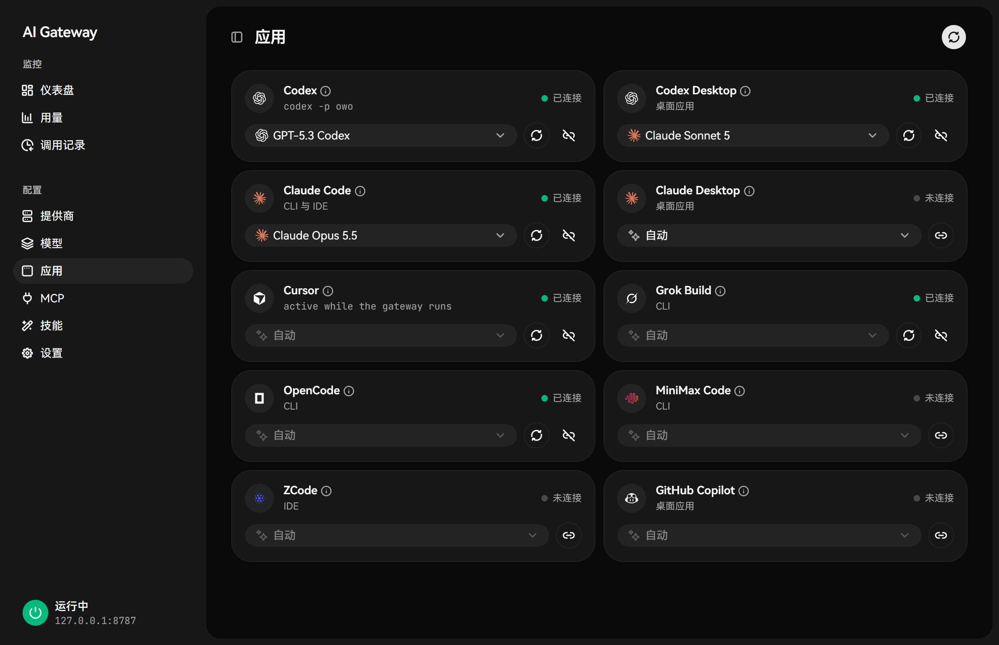</p>

- 支持 Codex CLI、Codex Desktop、Claude Code、Claude Desktop、Cursor、Grok Build、OpenCode、MiniMax Code、ZCode 和 GitHub Copilot。
- 接入、重新接入和断开都在卡片上操作。接入前会备份应用的配置，断开时还原。
- Codex 和 Claude 可以指定默认模型，其他应用在自己的界面里选择 OwO 提供的模型。

<br>

<h2 align="center">MCP 服务器</h2>

<p align="center">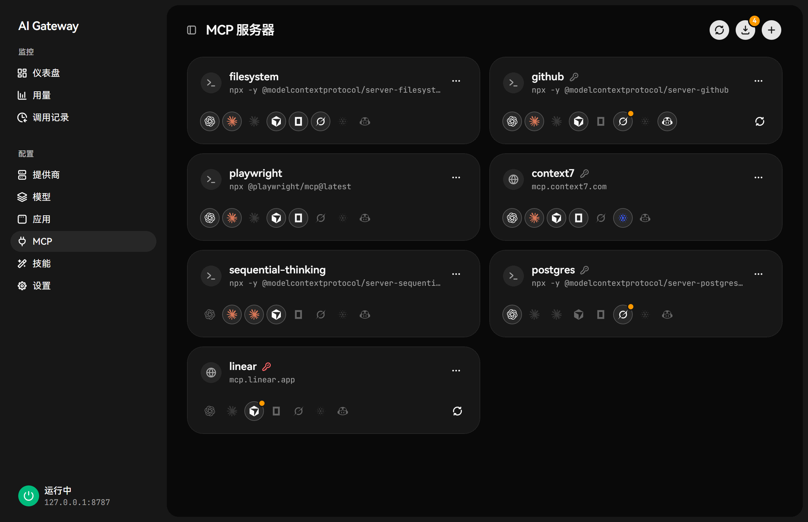</p>

<p align="center">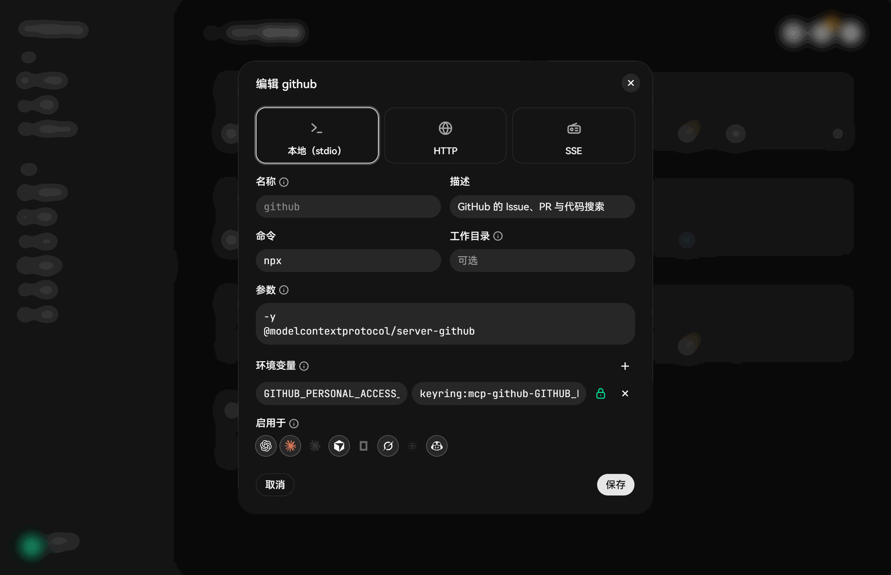</p>

- 同一个服务器可以写进 Codex、Claude Code、Claude Desktop、Cursor、OpenCode、Grok Build、MiniMax Code、ZCode 和 Copilot，每个应用单独开关。
- 支持本地命令（stdio）和远程 HTTP / SSE 服务器。
- 环境变量和请求头里的密钥可以存进系统钥匙串。
- 可以扫描各应用里已有的服务器，导入后统一管理。
- 如果某个条目在 OwO 写入后被别人改过，OwO 会报告冲突，不会直接覆盖。

<br>

<h2 align="center">技能</h2>

<p align="center">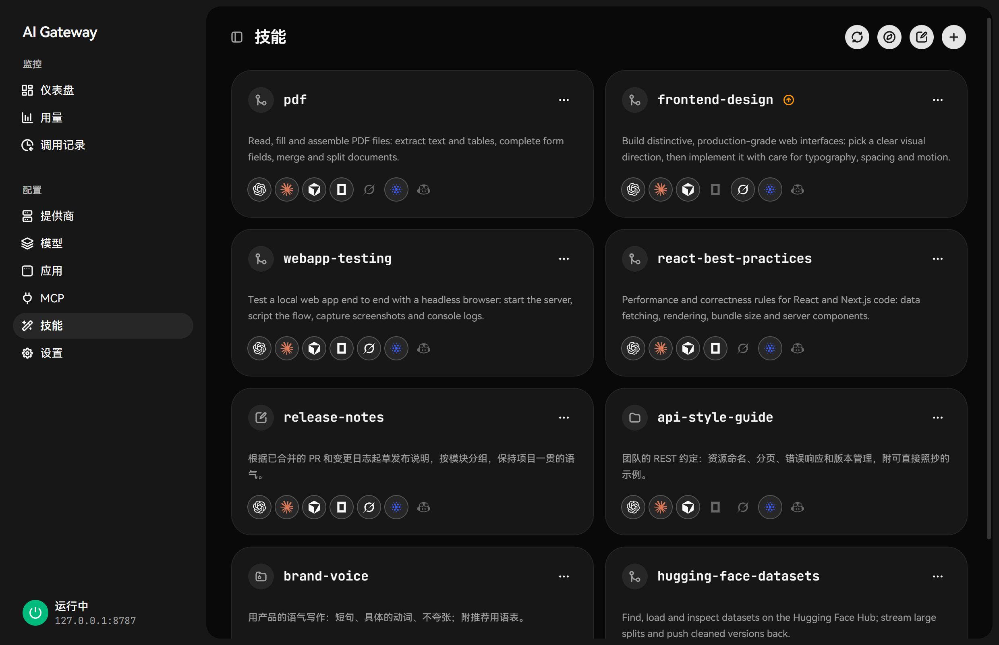</p>

<p align="center">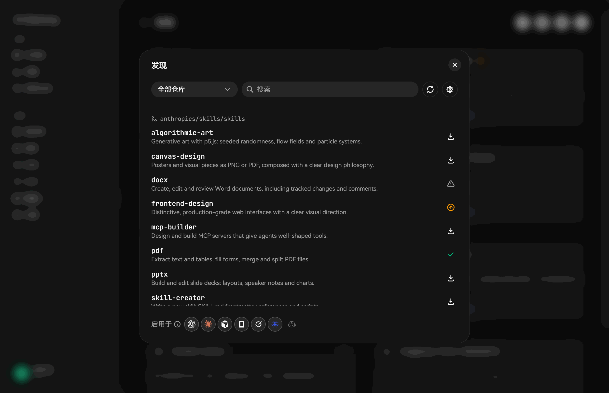</p>

<p align="center">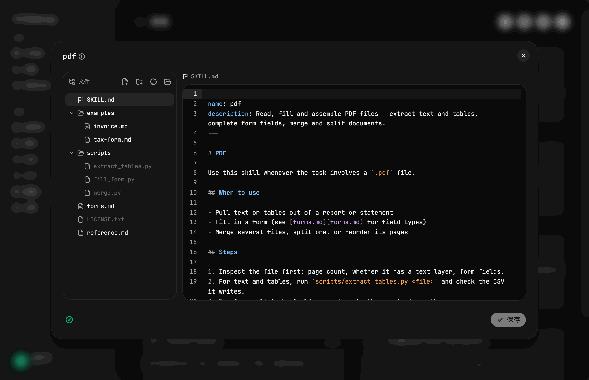</p>

- 技能统一放在 `~/.agents/skills`，每个应用可以单独开关。
- 可以从 anthropics、openai、vercel-labs、huggingface 和 MiniMax-AI 的技能仓库搜索安装，也可以安装本地文件夹或 zip。有新版本时会提示。
- 编辑器左侧是技能的文件树，技能目录里的 Markdown 文件都可以直接编辑，`SKILL.md` 标为入口。可以新建、重命名和删除文件与文件夹，格式有问题时会提示。
- 删除和更新前会自动备份。本机已有、但不归 OwO 管理的技能可以接管。

<br>

<h2 align="center">设置</h2>

<p align="center">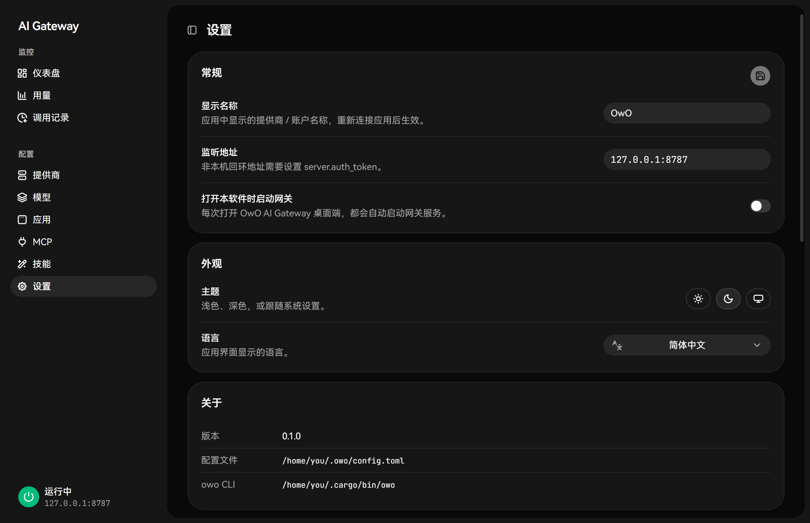</p>

<p align="center">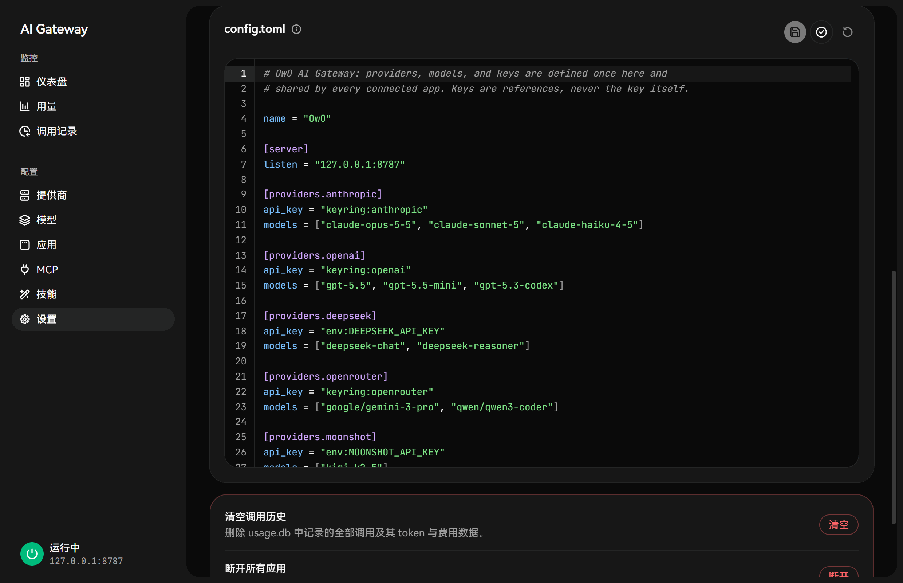</p>

- 显示名称、监听地址，以及打开桌面应用时是否自动启动网关。
- 主题可选浅色、深色或跟随系统，界面语言支持简体中文、English 和日本語。
- 可以直接编辑 `config.toml`，保存前会校验，出错时会标出对应的行。
- 清空调用记录、断开所有应用和重置配置放在页面底部，执行前需要确认。

<a id="compare"></a>

<br>

<h2 align="center">与同类项目对比</h2>

<br>

<h3 align="center">使用模式</h3>

<div align="center">

| | **OwO AI Gateway** | CC Switch | Claude Code Router | LiteLLM Proxy | New API |
|---|:---:|:---:|:---:|:---:|:---:|
| 工作方式 | 把模型写进应用的模型选择器 | 切换应用当前使用的供应商配置，可选本地代理 | 本地路由网关，按规则转发 | 通用 API 网关 | API 分发与计费平台 |
| 应用里显示的模型 | 各提供商的模型按原名列出 | 应用内置的模型名，映射到当前供应商 | 应用原来的模型名，由路由规则决定实际模型 | 在应用里手动填写 | 在应用里手动填写 |
| 切换模型 | 在应用的模型选择器里选 | 在 CC Switch 里切换供应商，多数工具需要重启 | 改路由规则，或用 `/model` 命令 | 改应用配置 | 改应用配置 |
| 同时使用多个提供商 | ✅ 每个对话可以选不同模型 | 每个应用同一时间只有一个供应商 | ✅ 路由规则 | ✅ | ✅ |

</div>

OwO 在各应用里使用的是应用自带的模型机制：

- **Codex CLI / Desktop**：写入 Codex 的模型目录，OwO 的模型会出现在 `/model` 和 Desktop 的模型选择器里。
- **Claude Code**：Claude Code 从网关读取可用模型并列在 `/model` 里。Claude 默认不显示的模型 ID 会自动加上前缀，让它能显示出来。
- **Cursor**：OwO 的模型出现在 Cursor 自带模型的旁边。
- **OpenCode、Grok Build、MiniMax Code、ZCode 和 Claude Desktop**：以一个提供商的形式写入，并带上模型列表。

<br>

<h3 align="center">功能</h3>

<div align="center">

| | **OwO AI Gateway** | CC Switch | Claude Code Router | LiteLLM Proxy | New API |
|---|:---:|:---:|:---:|:---:|:---:|
| 接入编程应用 | ✅ 10 个 | ✅ 7 个 | ✅ 启动配置档 | — | — |
| 接入 Cursor | ✅ | — | — | — | — |
| 协议转换（Responses / Chat / Messages） | ✅ | ✅ | ✅ | ✅ | ✅ |
| 断开后逐字节还原，冲突时不覆盖 | ✅ | 配置备份 | — | — | — |
| 密钥存在系统钥匙串 | ✅ | — | — | — | — |
| 把 MCP 写进各应用配置 | ✅ 9 个应用 | ✅ | 网关侧工具 | — | — |
| Agent Skills 发现与安装 | ✅ | ✅ | — | — | — |
| 应用内编辑技能的多个文件 | ✅ | — | — | — | — |
| 用量、费用和调用记录 | ✅ | ✅ | ✅ | ✅ | ✅ |

</div>

<p align="center"><sub>依据各项目 2026 年 9 月的公开文档。“—” 表示文档中没有对应功能，或者不在该项目的定位范围内。</sub></p>

<br>

<h3 align="center">性能与资源占用</h3>

<div align="center">

| | **OwO AI Gateway** | CC Switch | Claude Code Router | LiteLLM Proxy | New API |
|---|:---:|:---:|:---:|:---:|:---:|
| 实现 | Rust | Rust + WebView（Tauri 桌面应用） | TypeScript（Node.js） | Python | Go |
| 网关能否单独运行 | ✅ 单个进程 | 需要桌面应用保持运行 | ✅ | ✅ | ✅ |
| 运行时与依赖 | 无 | 桌面应用 | Node.js 22+ | Python 3；管理界面和用量统计需要 PostgreSQL | 数据库（SQLite / MySQL / PostgreSQL），通常用 Docker 部署 |
| 空闲内存（私有） | **约 4 MB**（实测） | 约 250 MB（实测） | 约 156 MB（实测） | 官方建议每个 worker 4 GiB | 未公布 |
| 部署要求 | 无特别要求 | 桌面环境 | Node.js 22+ | 官方生产建议 4 vCPU / 8 GB | Docker 和数据库 |

</div>

<div align="center">

| 空闲内存实测 | 版本 | 测量时的状态 | 私有内存 | 工作集 |
|---|:---:|---|:---:|:---:|
| **OwO AI Gateway** | 0.1.0（release 构建） | 网关运行，配置 1 个提供商 | **约 3.8 MB** | 约 13.8 MB |
| Claude Code Router | 3.1.1（npm） | `ccr serve --gateway`：网关和 Web 管理服务，配置 1 个提供商 | 约 156 MB | 约 145 MB |
| CC Switch | 3.20.3（Windows 便携版） | 桌面应用运行：1 个主进程和 6 个 WebView2 进程，本地代理未开启 | 约 250 MB | 约 455 MB* |

</div>

<div align="center">

| OwO 启动速度实测 | 结果 |
|---|---|
| 命令行冷启动 | 约 23 ms |
| 网关启动到开始监听 | 5 – 23 ms |
| 执行 `owo start` 到可以接受连接 | 约 0.5 秒（含系统创建进程的时间） |

</div>

<p align="center"><sub>测试条件：同一台 Windows 11 电脑，2026 年 9 月 25 日。OwO 和 Claude Code Router 各配置一个无需密钥的本地 Ollama 提供商，CC Switch 为首次启动后的默认状态，测量期间都没有发送请求。启动约 15 秒后开始采样，每 10 秒一次，共三次，取稳定后的数值，统计整个进程树。<br>* 工作集会把多个 WebView2 进程共享的内存重复计算，跨进程比较以私有内存为准。LiteLLM Proxy 和 New API 没有实测，数据来自公开资料：<a href="https://docs.litellm.ai/docs/proxy/prod">LiteLLM 生产最佳实践</a>、<a href="https://github.com/QuantumNous/new-api">New API README</a>。架构信息另见 <a href="https://ccswitch.co/docs/proxy-service.html">CC Switch 代理文档</a> 和 <a href="https://github.com/musistudio/claude-code-router">Claude Code Router README</a>。</sub></p>

<br>

**OwO 的不同之处**

- 模型直接出现在各应用自己的模型选择器里，显示的是模型的真实名称。每个对话可以选不同的模型，切换时不需要重启应用。
- 网关是一个 Rust 可执行文件，基于 Tokio 和 axum，流式响应按事件逐个转发，不等整条回复结束。不需要 Node.js、Python、数据库或 Docker，也不需要开着桌面应用。空闲时私有内存约 4 MB，大约是 Claude Code Router 的 1/40、CC Switch 的 1/60。
- 支持 10 个应用，其中 Cursor 是上表其他项目都没有接入的。
- 断开时，没被改动过的配置文件逐字节还原，改动过的只删除 OwO 写入的部分；有冲突时默认不覆盖。OwO 不读取也不修改应用的登录凭据。
- 配置文件里只写 `keyring:` 或 `env:` 引用，密钥存在系统钥匙串里。调用记录不保存提示词和回复。
- 模型、MCP 服务器和技能都在一个地方配置，再按应用开关。

如果需要给团队分发接口、按用户计费，或在多个上游之间自动故障转移，New API 或 LiteLLM Proxy 更合适。如果主要在 Gemini CLI 或 OpenClaw 里切换供应商，可以考虑 CC Switch。

<a id="quick-start"></a>

<br>

## 快速上手

目前需要从源码构建（Rust 1.85 及以上）：

```bash
cargo install --path apps/owo --locked     # 安装 owo；也可以用 cargo build --release -p owo，产物在 target/release/
```

第一次使用：

```bash
owo add anthropic          # 添加提供商：输入密钥（不回显），存进系统钥匙串，并写入 config.toml
owo start -d               # 在后台启动网关（默认 127.0.0.1:8787）；owo start 在前台运行
owo connect claude         # 把 Claude Code 接到网关；不带参数的 owo connect 会列出所有应用
owo                        # 总览：网关、模型、密钥问题、已接入的应用和下一步建议
```

更多提供商与模型：

```bash
owo providers presets                       # 列出内置预设
owo add deepseek --env DEEPSEEK_API_KEY     # 从环境变量读取密钥
owo add ollama --no-key -m qwen3:8b         # 本地服务，不需要密钥
owo add relay --url https://llm.example.com/v1 -m some-model   # 任意 OpenAI 兼容接口
owo providers discover openrouter           # 在线查询提供商当前的模型
owo check                                   # 不启动网关，检查配置、密钥和模型
```

日常使用：

```bash
owo connect codex-desktop -m claude-sonnet-5   # 接入并指定默认模型
owo launch codex                                # 只对这一次运行生效，不修改 Codex 的文件
owo usage --days 30 --by app                    # 最近 30 天按应用汇总
owo history --failed                            # 最近失败的调用
owo history 42                                  # 第 42 次调用的详细信息
owo disconnect claude                           # 撤销接入，恢复应用原来的设置
owo stop                                        # 停止网关
```

MCP 与技能：

```bash
owo mcp add github --command npx --arg -y --arg @modelcontextprotocol/server-github \
    --env GITHUB_PERSONAL_ACCESS_TOKEN=keyring:mcp-github-GITHUB_PERSONAL_ACCESS_TOKEN --app claude,cursor,codex
owo mcp enable github --app opencode       # 为更多应用开启
owo mcp scan                               # 列出应用里已有、但不归 OwO 管理的服务器
owo mcp import all fetch --keyring         # 导入并接管，看起来像密钥的值存进钥匙串

owo skills discover                        # 在内置的 GitHub 仓库里查找技能
owo skills install github:anthropics/skills/skills/pdf
owo skills disable pdf --app codex         # 对某个应用关闭
owo skills update --check                  # 检查更新
```

完整说明见 [命令行使用指南](docs/CLI.zh-CN.md)，每个命令也都支持 `--help`。

<a id="apps"></a>

## 支持的应用

| 名字 | 应用 | 接入方式 |
|---|---|---|
| `codex` | Codex CLI | 新增配置档 `owo`，用 `codex -p owo` 启动，平时的 `codex` 不受影响 |
| `codex-desktop` | Codex Desktop | 修改 `~/.codex/config.toml`，与 `codex` 互不影响 |
| `claude` | Claude Code（命令行及 IDE 插件） | 写入 `~/.claude/settings.json` 的 `env`，不需要登录 Claude 账号 |
| `claude-desktop` | Claude Desktop | 使用 Desktop 官方的“第三方推理”配置 |
| `cursor` | Cursor | OwO 的模型出现在 Cursor 自带模型旁边；首次接入会安装一个只签发 `*.cursor.sh` 的本地证书 |
| `grok` | Grok Build | 在 `~/.grok/config.toml` 末尾写入带标记的配置块 |
| `opencode` | OpenCode | 写入 `~/.config/opencode/opencode.json` |
| `mcode` | MiniMax Code | 写入 `~/.minimax/config.yaml` |
| `zcode` | ZCode | 写入 ZCode 的提供商配置 |
| `copilot` | GitHub Copilot 应用 | 需要在应用里手动添加，`owo connect copilot` 会打印需要填写的内容 |

MiniMax CLI（`mmx`）只支持 `owo launch mmx text chat|repl`。`owo launch` 目前支持 `claude`、`codex`、`opencode` 和 `mmx`。

<a id="providers"></a>

## 内置提供商预设

预设定义在 [`registry/providers.toml`](registry/providers.toml)，用 `owo add <预设>` 添加：

| 类型 | 预设 |
|---|---|
| Anthropic 协议 | `anthropic` |
| OpenAI 兼容 | `openai`、`openrouter`、`deepseek`、`xai`、`groq`、`cerebras`、`mistral`、`together`、`fireworks`、`moonshot`、`minimax`、`nvidia`、`siliconflow`、`zhipu-bigmodel`、`volcengine`、`deepinfra`、`novita`、`sambanova`、`stepfun` |
| 本地服务（无需密钥） | `ollama`、`vllm`、`lm-studio`、`litellm` |
| 尚未可用 | `google`（Gemini 适配器还没有实现） |

不在列表里的服务，可以用 `owo add <名字> --url <地址>` 接入 OpenAI 兼容接口，加上 `--adapter anthropic` 则接入 Anthropic 兼容接口。

<a id="security"></a>

## 安全与隐私

- **网络**：默认只监听 `127.0.0.1:8787`，监听其他地址时必须配置 `server.auth_token`。控制 API（`/control/v1`）会检查请求来源，并防止 DNS 重绑定。
- **密钥**：`config.toml` 里只写引用（`keyring:名字` 或 `env:变量名`），密钥本身存在系统钥匙串里（Windows 凭据管理器、macOS 钥匙串或 Linux Secret Service）。日志、命令行输出和控制 API 都不会打印密钥，直接写在配置里的密钥只显示为 `inline`。
- **调用记录**：`~/.owo/state/usage.db` 只保存元数据和 Token 数，不保存提示词和回复。错误信息会去掉网址里的查询参数，并截断到 500 个字符。
- **配置改动**：修改应用配置前先备份，并记下原来的值。`disconnect` 时，如果文件在接入后没被改过，就逐字节还原；如果被改过，只删除 OwO 写入的条目。遇到冲突时默认不覆盖，需要加 `-f` 确认。
- **登录凭据**：不读取、也不修改任何应用的登录凭据，例如 Codex 的 `~/.codex/auth.json`。
- **账号与客户端**：不伪造订阅或账号权益，也不冒充官方客户端绕过上游的准入限制。上游明确只允许自家客户端访问时，OwO 会提示这一限制。

<a id="architecture"></a>

## 架构

所有入站请求先解码成统一的内部请求和事件模型（`owo-core`），再由路由器交给出站适配器，编码后发往上游。新增一个应用或提供商时，只需要实现它自己的编解码，不用为每两种协议之间写转换。

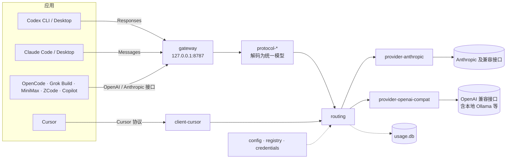

| crate | 作用 |
|---|---|
| `core` | 统一的请求、事件和错误模型 |
| `sse` | 增量 SSE 解码与编码 |
| `config` | `config.toml` 的结构、路径和校验 |
| `credentials` | 解析密钥引用（环境变量、系统钥匙串） |
| `registry` | 提供商预设、模型注册表和别名 |
| `protocol-openai-responses`、`protocol-openai-chat`、`protocol-anthropic` | 各协议与统一模型之间的转换 |
| `routing` | 适配器接口和请求路由 |
| `provider-http`、`provider-openai-compat`、`provider-anthropic` | 上游 HTTP 基础设施和适配器 |
| `gateway` | 本地 HTTP 网关（面向应用的接口和控制 API） |
| `usage` | 调用记录和 Token 用量（SQLite） |
| `client-codex`、`client-claude-code`、`client-apps` | 各应用的可撤销接入（`client-apps` 负责 Grok Build、OpenCode、MiniMax、ZCode 和 Copilot） |
| `client-cursor`、`cursor-semble` | Cursor 集成，以及 Cursor 使用的本地语义代码搜索 |
| `mcp`、`skills` | MCP 服务器和 Agent Skills 的管理 |

## 仓库结构

```text
apps/owo/                 owo 命令行：网关和全部管理命令，一个可执行文件
apps/desktop/             桌面应用（Tauri 2 + React）
crates/                   各功能 crate（见上表）
registry/providers.toml   内置提供商预设
docs/                     命令行指南和图片
```

## 开发

```bash
cargo test --workspace
cargo clippy --workspace --all-targets -- -D warnings
```

桌面应用需要 Node.js，以及 [Tauri 2 的系统依赖](https://v2.tauri.app/start/prerequisites/)：

```bash
cd apps/desktop
npm install
npm run tauri dev
```

桌面应用直接读取配置和用量数据，也直接编辑提供商、模型和 `config.toml`。启停网关、接入应用，以及 MCP 和技能的变更，则通过调用 `owo` 命令行完成。它会依次在 `OWO_BIN`、应用所在目录、`PATH` 和本仓库的 `target/` 下查找 `owo`。

<br>

<p align="center">
  <br>
  <sub><a href="LICENSE">MIT</a> © 2026 OwO</sub>
</p>
